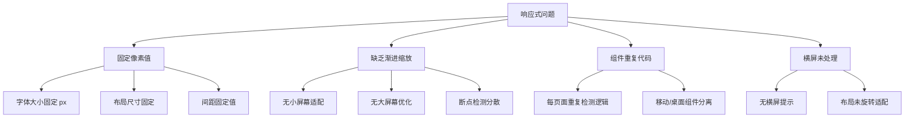
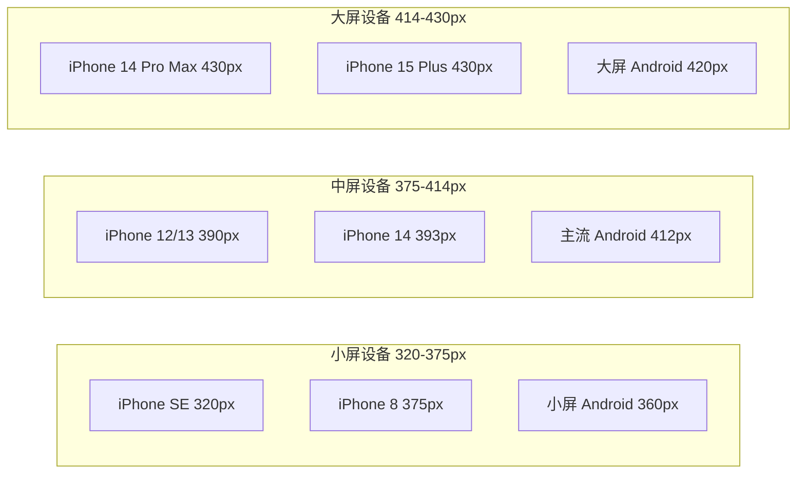

# 响应式布局与自适应设计优化实施计划

> **For Claude:** REQUIRED SUB-SKILL: Use superpowers:executing-plans to implement this plan task-by-task.

**Goal:** 实现能够根据不同移动设备屏幕尺寸、分辨率和像素密度自动调整的界面布局，确保在主流手机型号上保持一致的用户体验。

**Architecture:** 采用 CSS 变量 + clamp() 函数实现流体缩放，统一响应式 Hook 管理屏幕状态，横屏锁定显示提示遮罩，全面替换固定像素值为相对单位。

**Tech Stack:** React 18 + TypeScript + Tailwind CSS v4 + CSS Variables

---

## 问题诊断

### 当前存在的问题



### 具体问题清单

| 问题类型 | 文件位置 | 问题描述 |
|----------|----------|----------|
| 固定字体 | 所有页面组件 | `fontSize: 20` 等固定值 |
| 固定间距 | 所有页面组件 | `padding: 16` 等固定值 |
| 固定尺寸 | App.tsx | Tab Bar 高度 `height: 64` |
| 重复逻辑 | 所有页面 | `useEffect` 检测 `isDesktop` |
| 横屏未处理 | App.tsx | 无横屏检测和提示 |

---

## 设备适配范围



---

## 文件改动清单

| 序号 | 文件路径 | 操作类型 | 主要改动 |
|------|----------|----------|----------|
| 1 | `src/styles/responsive.css` | 修改 | 升级响应式变量系统 |
| 2 | `src/app/hooks/useResponsive.ts` | 新增 | 响应式工具 Hook |
| 3 | `src/app/hooks/useOrientation.ts` | 新增 | 屏幕方向 Hook |
| 4 | `src/app/components/ui/ResponsiveProvider.tsx` | 新增 | 响应式上下文 Provider |
| 5 | `src/app/App.tsx` | 修改 | 集成响应式系统，添加横屏锁定 |
| 6 | `src/app/components/HomePage.tsx` | 修改 | 替换固定值为响应式单位 |
| 7 | `src/app/components/TodayPage.tsx` | 修改 | 替换固定值为响应式单位 |
| 8 | `src/app/components/WorkoutPage.tsx` | 修改 | 替换固定值为响应式单位 |
| 9 | `src/app/components/ProfilePage.tsx` | 修改 | 替换固定值为响应式单位 |
| 10 | `src/app/components/MallPage.tsx` | 修改 | 替换固定值为响应式单位 |
| 11 | `src/app/components/DesktopSidebar.tsx` | 修改 | 响应式侧边栏 |
| 12 | `src/app/components/pages/*.tsx` | 修改 | 统一改造模式 |

---

## Task 1: 升级响应式 CSS 变量系统

**Files:**
- Modify: `src/styles/responsive.css`

**Step 1: 升级字体变量为流体缩放**

将固定像素值替换为 `clamp()` 函数实现流体缩放：

```css
/* 字体缩放 - 使用 clamp() 实现流体缩放 */
--font-size-xs: clamp(10px, 2.5vw, 11px);
--font-size-sm: clamp(12px, 3vw, 13px);
--font-size-base: clamp(14px, 3.5vw, 15px);
--font-size-lg: clamp(16px, 4vw, 18px);
--font-size-xl: clamp(18px, 4.5vw, 22px);
--font-size-2xl: clamp(22px, 5.5vw, 28px);
--font-size-3xl: clamp(26px, 6.5vw, 32px);
```

**Step 2: 升级间距变量为相对单位**

```css
/* 间距缩放 - 使用 vw + rem 混合单位 */
--spacing-xs: clamp(3px, 1vw, 4px);
--spacing-sm: clamp(6px, 2vw, 8px);
--spacing-md: clamp(12px, 3vw, 16px);
--spacing-lg: clamp(18px, 4.5vw, 24px);
--spacing-xl: clamp(24px, 6vw, 32px);
--spacing-2xl: clamp(36px, 9vw, 48px);
```

**Step 3: 添加安全区域变量**

```css
/* 安全区域 - 适配刘海屏和底部手势条 */
--safe-area-top: env(safe-area-inset-top, 0px);
--safe-area-bottom: env(safe-area-inset-bottom, 0px);
--safe-area-left: env(safe-area-inset-left, 0px);
--safe-area-right: env(safe-area-inset-right, 0px);
```

**Step 4: 添加横屏锁定样式**

```css
/* 横屏锁定遮罩 */
.orientation-lock-overlay {
  display: none;
  position: fixed;
  inset: 0;
  z-index: 9999;
  background: linear-gradient(135deg, #FF7D3B 0%, #FF5500 100%);
  flex-direction: column;
  align-items: center;
  justify-content: center;
  color: white;
}

@media (orientation: landscape) and (max-width: 767px) {
  .orientation-lock-overlay {
    display: flex;
  }
}

.orientation-lock-icon {
  width: 80px;
  height: 80px;
  margin-bottom: 24px;
  animation: rotate-phone 2s ease-in-out infinite;
}

@keyframes rotate-phone {
  0%, 100% { transform: rotate(0deg); }
  50% { transform: rotate(-90deg); }
}
```

**Step 5: 添加响应式工具类**

```css
/* 响应式字体工具类 */
.text-fluid-xs { font-size: var(--font-size-xs); }
.text-fluid-sm { font-size: var(--font-size-sm); }
.text-fluid-base { font-size: var(--font-size-base); }
.text-fluid-lg { font-size: var(--font-size-lg); }
.text-fluid-xl { font-size: var(--font-size-xl); }
.text-fluid-2xl { font-size: var(--font-size-2xl); }

/* 响应式间距工具类 */
.p-fluid-xs { padding: var(--spacing-xs); }
.p-fluid-sm { padding: var(--spacing-sm); }
.p-fluid-md { padding: var(--spacing-md); }
.p-fluid-lg { padding: var(--spacing-lg); }
.p-fluid-xl { padding: var(--spacing-xl); }

.gap-fluid-xs { gap: var(--spacing-xs); }
.gap-fluid-sm { gap: var(--spacing-sm); }
.gap-fluid-md { gap: var(--spacing-md); }
.gap-fluid-lg { gap: var(--spacing-lg); }
```

---

## Task 2: 创建响应式工具 Hook

**Files:**
- Create: `src/app/hooks/useResponsive.ts`

**Step 1: 创建 useResponsive Hook**

```typescript
/**
 * 响应式工具 Hook
 * 提供屏幕尺寸、设备类型、安全区域等响应式信息
 */
import { useState, useEffect, useCallback } from 'react';

// 断点定义 - 与 CSS 变量同步
export const BREAKPOINTS = {
  mobile: 480,
  tablet: 768,
  desktop: 1024,
  wide: 1440,
} as const;

// 屏幕尺寸类型
export interface ScreenSize {
  width: number;
  height: number;
}

// 设备类型
export type DeviceType = 'mobile' | 'tablet' | 'desktop';

// 安全区域
export interface SafeAreaInsets {
  top: number;
  bottom: number;
  left: number;
  right: number;
}

// 响应式状态
export interface ResponsiveState {
  // 设备类型
  isMobile: boolean;
  isTablet: boolean;
  isDesktop: boolean;
  deviceType: DeviceType;
  
  // 屏幕尺寸
  screenWidth: number;
  screenHeight: number;
  
  // 屏幕方向
  isPortrait: boolean;
  isLandscape: boolean;
  
  // 安全区域
  safeAreaInsets: SafeAreaInsets;
  
  // 缩放比例 (基于 375px 设计稿)
  scale: number;
}

/**
 * 获取当前响应式状态
 */
export function useResponsive(): ResponsiveState {
  const [state, setState] = useState<ResponsiveState>(() => getInitialState());

  useEffect(() => {
    const handleResize = () => {
      setState(getInitialState());
    };

    // 监听窗口大小变化
    window.addEventListener('resize', handleResize);
    
    // 监听屏幕方向变化
    const mediaQuery = window.matchMedia('(orientation: portrait)');
    mediaQuery.addEventListener('change', handleResize);

    return () => {
      window.removeEventListener('resize', handleQuery);
      mediaQuery.removeEventListener('change', handleResize);
    };
  }, []);

  return state;
}

/**
 * 获取初始状态
 */
function getInitialState(): ResponsiveState {
  const width = window.innerWidth;
  const height = window.innerHeight;
  
  // 计算设备类型
  const isMobile = width < BREAKPOINTS.tablet;
  const isTablet = width >= BREAKPOINTS.tablet && width < BREAKPOINTS.desktop;
  const isDesktop = width >= BREAKPOINTS.desktop;
  
  // 计算缩放比例 (基于 375px 设计稿)
  const baseWidth = 375;
  const scale = Math.min(width / baseWidth, 1.2); // 最大放大 1.2 倍
  
  // 获取安全区域
  const safeAreaInsets = getSafeAreaInsets();

  return {
    isMobile,
    isTablet,
    isDesktop,
    deviceType: isMobile ? 'mobile' : isTablet ? 'tablet' : 'desktop',
    screenWidth: width,
    screenHeight: height,
    isPortrait: height > width,
    isLandscape: width > height,
    safeAreaInsets,
    scale,
  };
}

/**
 * 获取安全区域 insets
 */
function getSafeAreaInsets(): SafeAreaInsets {
  const computedStyle = getComputedStyle(document.documentElement);
  
  return {
    top: parseInt(computedStyle.getPropertyValue('--safe-area-top') || '0', 10),
    bottom: parseInt(computedStyle.getPropertyValue('--safe-area-bottom') || '0', 10),
    left: parseInt(computedStyle.getPropertyValue('--safe-area-left') || '0', 10),
    right: parseInt(computedStyle.getPropertyValue('--safe-area-right') || '0', 10),
  };
}

/**
 * 获取缩放后的字体大小
 */
export function useScaledSize() {
  const { scale } = useResponsive();
  
  const getScaledSize = useCallback((baseSize: number): number => {
    return Math.round(baseSize * scale);
  }, [scale]);

  return { scale, getScaledSize };
}
```

**Step 2: 验证文件创建成功**

检查文件路径是否正确，确保 TypeScript 无语法错误。

---

## Task 3: 创建屏幕方向 Hook

**Files:**
- Create: `src/app/hooks/useOrientation.ts`

**Step 1: 创建 useOrientation Hook**

```typescript
/**
 * 屏幕方向 Hook
 * 检测屏幕方向并提供横屏锁定提示功能
 */
import { useState, useEffect } from 'react';

export type Orientation = 'portrait' | 'landscape';

export interface OrientationState {
  // 当前方向
  orientation: Orientation;
  
  // 是否竖屏
  isPortrait: boolean;
  
  // 是否横屏
  isLandscape: boolean;
  
  // 是否需要显示锁定提示 (移动端横屏时)
  shouldShowLockOverlay: boolean;
}

/**
 * 获取当前屏幕方向状态
 */
export function useOrientation(): OrientationState {
  const [state, setState] = useState<OrientationState>(() => getOrientationState());

  useEffect(() => {
    const handleOrientationChange = () => {
      setState(getOrientationState());
    };

    // 监听窗口大小变化
    window.addEventListener('resize', handleOrientationChange);
    
    // 监听设备方向变化
    window.addEventListener('orientationchange', handleOrientationChange);

    return () => {
      window.removeEventListener('resize', handleOrientationChange);
      window.removeEventListener('orientationchange', handleOrientationChange);
    };
  }, []);

  return state;
}

/**
 * 获取方向状态
 */
function getOrientationState(): OrientationState {
  const width = window.innerWidth;
  const height = window.innerHeight;
  const isPortrait = height >= width;
  const isMobile = width < 768;

  return {
    orientation: isPortrait ? 'portrait' : 'landscape',
    isPortrait,
    isLandscape: !isPortrait,
    // 仅在移动端横屏时显示锁定提示
    shouldShowLockOverlay: isMobile && !isPortrait,
  };
}
```

**Step 2: 验证文件创建成功**

---

## Task 4: 创建响应式 Provider

**Files:**
- Create: `src/app/components/ui/ResponsiveProvider.tsx`

**Step 1: 创建 ResponsiveProvider 组件**

```typescript
/**
 * 响应式上下文 Provider
 * 提供全局响应式状态和横屏锁定 UI
 */
import { createContext, useContext, ReactNode } from 'react';
import { useResponsive, ResponsiveState } from '../../hooks/useResponsive';
import { useOrientation, OrientationState } from '../../hooks/useOrientation';
import { Smartphone } from 'lucide-react';

// 响应式上下文类型
interface ResponsiveContextValue {
  responsive: ResponsiveState;
  orientation: OrientationState;
}

// 创建上下文
const ResponsiveContext = createContext<ResponsiveContextValue | undefined>(undefined);

// Provider Props
interface ResponsiveProviderProps {
  children: ReactNode;
}

/**
 * 响应式 Provider 组件
 */
export function ResponsiveProvider({ children }: ResponsiveProviderProps) {
  const responsive = useResponsive();
  const orientation = useOrientation();

  return (
    <ResponsiveContext.Provider value={{ responsive, orientation }}>
      {children}
      
      {/* 横屏锁定提示遮罩 */}
      {orientation.shouldShowLockOverlay && <OrientationLockOverlay />}
    </ResponsiveContext.Provider>
  );
}

/**
 * 横屏锁定提示遮罩组件
 */
function OrientationLockOverlay() {
  return (
    <div className="orientation-lock-overlay">
      {/* 旋转图标 */}
      <div className="orientation-lock-icon">
        <Smartphone size={80} strokeWidth={1.5} />
      </div>
      
      {/* 提示文字 */}
      <div style={{ fontWeight: 700, fontSize: 20, marginBottom: 8 }}>
        请旋转设备
      </div>
      <div style={{ fontSize: 14, opacity: 0.8, textAlign: 'center', padding: '0 40px' }}>
        为获得最佳体验，请将设备旋转至竖屏模式
      </div>
    </div>
  );
}

/**
 * 获取响应式上下文的 Hook
 */
export function useResponsiveContext(): ResponsiveContextValue {
  const context = useContext(ResponsiveContext);
  if (!context) {
    throw new Error('useResponsiveContext must be used within ResponsiveProvider');
  }
  return context;
}
```

**Step 2: 验证文件创建成功**

---

## Task 5: 创建 hooks 目录索引文件

**Files:**
- Create: `src/app/hooks/index.ts`

**Step 1: 创建索引文件**

```typescript
/**
 * Hooks 统一导出
 */
export { useResponsive, useScaledSize, BREAKPOINTS } from './useResponsive';
export type { ResponsiveState, ScreenSize, DeviceType, SafeAreaInsets } from './useResponsive';

export { useOrientation } from './useOrientation';
export type { OrientationState, Orientation } from './useOrientation';
```

---

## Task 6: 修改 App.tsx 集成响应式系统

**Files:**
- Modify: `src/app/App.tsx`

**Step 1: 导入 ResponsiveProvider**

在文件顶部添加导入：

```typescript
import { ResponsiveProvider } from "./components/ui/ResponsiveProvider";
```

**Step 2: 包裹 ResponsiveProvider**

修改 App 组件，在 DisplayModeProvider 内部包裹 ResponsiveProvider：

```typescript
export default function App() {
  return (
    <DisplayModeProvider>
      <ResponsiveProvider>
        <NavigationProvider>
          <AppContent />
        </NavigationProvider>
      </ResponsiveProvider>
    </DisplayModeProvider>
  );
}
```

**Step 3: 移除 ResponsiveLayout 中的重复检测逻辑**

删除 ResponsiveLayout 组件中的 `isMobile` state 和 `useEffect` 检测逻辑，改用 useResponsiveContext：

```typescript
function ResponsiveLayout() {
  const { currentPage, navigate } = useNavigation();
  const { responsive } = useResponsiveContext();
  const activeTab = getTabKey(currentPage);
  const showTabBar = isTabPage(currentPage);

  // 使用 responsive.isMobile 替代原来的 state
  if (responsive.isMobile) {
    // 移动端布局...
  }

  // 桌面端布局...
}
```

**Step 4: 替换固定像素值为 CSS 变量**

将 Tab Bar 的固定高度改为使用 CSS 变量：

```typescript
// 改造前
style={{ height: 64 }}

// 改造后
style={{ height: 'var(--tab-bar-height)' }}
```

---

## Task 7: 改造 HomePage.tsx

**Files:**
- Modify: `src/app/components/HomePage.tsx`

**Step 1: 导入 useResponsiveContext**

```typescript
import { useResponsiveContext } from './ui/ResponsiveProvider';
```

**Step 2: 移除重复的检测逻辑**

删除 `isDesktop` state 和 `useEffect` 检测：

```typescript
// 删除以下代码
const [isDesktop, setIsDesktop] = useState(false);

useEffect(() => {
  const checkDesktop = () => {
    setIsDesktop(window.innerWidth >= 768);
  };
  checkDesktop();
  window.addEventListener('resize', checkDesktop);
  return () => window.removeEventListener('resize', checkDesktop);
}, []);
```

**Step 3: 使用 useResponsiveContext**

```typescript
export function HomePage() {
  const [currentBanner, setCurrentBanner] = useState(0);
  const { responsive } = useResponsiveContext();
  const { navigate } = useNavigation();

  // 使用 responsive.isDesktop
  if (responsive.isDesktop) {
    return <DesktopHomePage ... />;
  }

  return <MobileHomePage ... />;
}
```

**Step 4: 替换固定字体大小**

将所有 `fontSize: XX` 替换为响应式类名或 CSS 变量：

```typescript
// 改造前
style={{ fontSize: 18 }}

// 改造后 - 方案1: 使用 CSS 变量
style={{ fontSize: 'var(--font-size-lg)' }}

// 改造后 - 方案2: 使用 Tailwind 类
className="text-fluid-lg"
```

**Step 5: 替换固定间距**

```typescript
// 改造前
style={{ padding: 16 }}

// 改造后
style={{ padding: 'var(--spacing-md)' }}
```

---

## Task 8: 改造 TodayPage.tsx

**Files:**
- Modify: `src/app/components/TodayPage.tsx`

**Step 1: 导入 useResponsiveContext**

```typescript
import { useResponsiveContext } from './ui/ResponsiveProvider';
```

**Step 2: 移除重复检测逻辑并使用 useResponsiveContext**

同 Task 7 的改造模式。

**Step 3: 替换所有固定字体大小和间距**

搜索并替换所有 `fontSize: XX` 和固定 `padding`/`margin` 值。

---

## Task 9: 改造 WorkoutPage.tsx

**Files:**
- Modify: `src/app/components/WorkoutPage.tsx`

**改造步骤同 Task 7 和 Task 8**

---

## Task 10: 改造 ProfilePage.tsx

**Files:**
- Modify: `src/app/components/ProfilePage.tsx`

**改造步骤同 Task 7 和 Task 8**

---

## Task 11: 改造 MallPage.tsx

**Files:**
- Modify: `src/app/components/MallPage.tsx`

**改造步骤同 Task 7 和 Task 8**

---

## Task 12: 改造 DesktopSidebar.tsx

**Files:**
- Modify: `src/app/components/DesktopSidebar.tsx`

**Step 1: 替换固定宽度为 CSS 变量**

```typescript
// 改造前
style={{ width: 240 }}

// 改造后
style={{ width: 'var(--sidebar-width)' }}
```

---

## Task 13: 改造子页面组件

**Files:**
- Modify: `src/app/components/pages/*.tsx`

**改造策略：**

对于所有子页面组件，执行以下统一改造：

1. 导入 `useResponsiveContext`
2. 移除重复的 `isDesktop` 检测逻辑
3. 替换固定字体大小为 CSS 变量
4. 替换固定间距为 CSS 变量

**需要改造的文件列表：**

1. `CoachMatchingPage.tsx`
2. `CityBuddyPage.tsx`
3. `CoachProfilePage.tsx`
4. `MembershipPage.tsx`
5. `VideoPlayerPage.tsx`
6. `CoachListPage.tsx`
7. `TrialClassPage.tsx`
8. `TrialClassDetailPage.tsx`
9. `LocationPage.tsx`
10. `ClassCheckInPage.tsx`
11. `TrainingReportPage.tsx`
12. `LessonPackPage.tsx`
13. `ProductDetailPage.tsx`
14. `GrowthReportPage.tsx`
15. `CoachOnboardingPage.tsx`
16. `SearchPage.tsx`
17. `MessageCenterPage.tsx`

---

## Task 14: 验证和测试

**Step 1: 运行开发服务器**

```bash
npm run dev
```

**Step 2: 测试不同设备尺寸**

使用浏览器开发者工具测试以下尺寸：

| 设备 | 宽度 | 预期效果 |
|------|------|----------|
| iPhone SE | 320px | 内容正常显示，字体和间距自适应缩小 |
| iPhone 8 | 375px | 标准显示效果 |
| iPhone 14 | 393px | 标准显示效果 |
| iPhone 14 Pro Max | 430px | 内容正常显示，字体和间距自适应放大 |

**Step 3: 测试横屏模式**

1. 在移动端模式下旋转到横屏
2. 验证横屏锁定遮罩是否显示
3. 验证旋转回竖屏后遮罩是否消失

**Step 4: 检查 TypeScript 类型**

```bash
npx tsc --noEmit
```

---

## 验收标准

1. **设备兼容性**：在 320px - 430px 范围内的所有设备上正常显示
2. **横屏处理**：移动端横屏时显示旋转提示遮罩
3. **字体自适应**：使用 `clamp()` 实现流体缩放
4. **间距自适应**：使用 CSS 变量实现响应式间距
5. **代码质量**：无 TypeScript 错误，无重复代码
6. **性能**：无明显性能下降

---

## 提交记录

完成每个 Task 后执行 Git 提交：

```bash
git add .
git commit -m "feat: Task N - 描述"
```

---

**Plan complete and saved to `docs/plans/2026-03-23-responsive-layout-optimization.md`.**

**Two execution options:**

**1. Subagent-Driven (this session)** - I dispatch fresh subagent per task, review between tasks, fast iteration

**2. Parallel Session (separate)** - Open new session with executing-plans, batch execution with checkpoints

**Which approach?**
